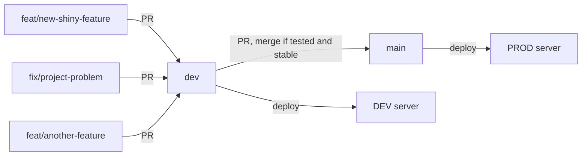

[](https://github.com/RSE-Sheffield/RSEAdmin/actions)
[](https://codecov.io/gh/RSE-Sheffield/RSEAdmin)
[](https://rseadmin.readthedocs.io/en/latest/?badge=latest)
    

# RSE Administration Tool 

This is a tool for tracking grant applications, managing RSE commitment and reporting on staff expenses and cost recovery.

The tool is a web app written using the [Django][django] web framework (Python) and the [AdminLTE][adminlte2] theme.

This readme covers installation, getting started and access to the demo site. Please refer to the [User Guide][userguide] documentation for a description of features.

## Demo site

A live version of the tool is available online at:

[https://rsesheffield.pythonanywhere.com](https://rsesheffield.pythonanywhere.com)

You can log in as either an RSE user (username of `user[0-9]` with password `12345`) or as an admin (username of `rseadmin` with password `demosite`).

The site is populated with random demo data which is reset at midnight every night.

## Contributing

For any new code you should create a new branch from the `dev` branch and create a pull request to merge into it. The `main` branch will be the default branch for deployment and should only have pull requests from the `dev` branch. Only stable changes can merge into the `main` branch.



## Development using docker containers

You'll need to install [Docker](https://www.docker.com/), this can be done by either install Docker Desktop, or just the Docker Engine.

Use the following command to build images:

```bash
docker compose build --pull
```

Run containers:

```bash
docker compose up -d
```

Setup Postgres database using the script:

```bash
docker-compose exec --user postgres db sh /tmp/db_init.sh
```

This script will create a user `django` with password `django_postgres` with an associated database called `django`.

You can also setup the database manually using the following commands:

```bash
# Create the user, you'll need to enter the password
# https://www.postgresql.org/docs/current/app-createuser.html
docker-compose exec --user postgres db createuser --pwprompt django
```

And create their database:

```bash
docker-compose exec --user postgres db createdb --owner=django django
```

Then use the commands from the [next section](#development-install-using-poetry) to build the database, collect static files, create an admin user etc. For example:

```bash
docker compose exec app poetry run python manage.py migrate
```

You do not need to run the command for running the server, as it will be handled via the commands in the container image and in the docker-compose file.

## Development install using Poetry


To develop or test the site locally Poetry is used for dependency management. The ideal is that Poetry is simpler than using [conda][conda] and avoids manually creating a [virtualenv][virtualenv]. To configure Poetry;

 1. Ensure you have Python >= 3.6 installed
 1. Install [Poetry][poetry], a tool for Python project management - see [notes on how to install](https://pypi.org/project/poetry/)
 1. Clone this repo
 1. From the repo directory call `poetry install` to install project dependencies in an isolated hidden virtualenv 
    Dependencies are determined using info from `pyproject.toml`

### Building the database

For a new clone of the site you must apply the database migrations and apply them by running the following command:

```sh
poetry run python manage.py migrate
```

This will create the database and apply and migrations (changes to the database structure tracked via git). The above can also be used on an existing database to update after a pulling any changes.

### Collect any static files

Static files must be collected before running the development server by running the following command:

```sh
poetry run python manage.py collectstatic
```

This will gather any static (images, javascript, css, etc.) files from the various applications used by RSEAdmin into a single `static-root` directory.

### Populating your development database with test data

The following process cab be used to generate data for experimenting with the system during development. If you would prefer to start with an empty database then you can omit this stage.

```sh
poetry run python manage.py shell
from rse.tests.test_random_data import *
random_project_and_allocation_data()
```

This will populate your development/production database with test data. To reset the database delete the db.sqlite3 file and rebuild it by calling the 'migrate' command.

### Creating an Admin user

To log into the admin interface (which allows the creation of other Admin and RSE users) you need an admin (superuser) account. You can create one as follows:

```sh
poetry run python manage.py createsuperuser
```

### Starting a development Django server and Navigating the Site

```sh
poetry run python manage.py runserver 8080
```
    
The website will then be viewable at [http://127.0.0.1:8080](http://127.0.0.1:8080).

All pages of the site require logging in. You can use your super user account or if you have generated some random data you can use the RSE users user0-user10 with the password '12345'.

The site has a self explanatory navigation menu which varies depending on the permissions of the user.


## Testing

The site uses continuous integration. You can run all tests locally as follows. This requires the installation of [https://github.com/mozilla/geckodriver](GeckoDriver (Firefox web driver)) which must be available on your `$PATH`:

```sh
poetry run python manage.py test
```

Note: The testing is mainly around model and ensuring that templates render without errors or permission problems. Forms and Views are not currently unit tested.

Individual test modules can be applied as follows (where `test_models` and `test_random_data` are both model tests);

```sh
poetry run python manage.py test rse.tests.test_models
poetry run python manage.py test rse.tests.test_random_data
poetry run python manage.py test rse.tests.test_templates
```

Individual test cases can also be run in isolation. I.e. 

```sh
poetry run python manage.py test rse.tests.test_models.SalaryCalculationTests
```

## Deployment to PythonAnywhere

By default the RSEAdmin tool will use the development settings (located in [`RSEAdmin/settings/dev.py`](RSEAdmin/settings/dev.py)). For production there are various development settings which are not ideal (i.e. a public secret key, debug mode, choice of database). A settings file [`RSEAdmin/settings/pythonanywhere.py`](RSEAdmin/settings/pythonanywhere.py) is provided for the [Python Anywhere](http://www.pythonanaywhere.com) who provide a free tier of hosting for Django sites.

To deploy on Python Anywhere create a new web app (from the Web tab) using a manual configuration. 

From the Databases tab create a new database and make a note of the database name, username and password.

From the Dashboard tab select `Browse Files` and create a new file `RSEAdmin\settings\secrets.json`. Inside this file set: `SECRET_KEY` to a random string (use an online generator), `DB_PASSWORD` to your database password, `DB_NAME` to your database name, `DB_USER` to your database user and `PA_USER` to your Python Anywhere username.

Now from the Dashboard tab create a new Bash console to clone the site and setup a virtual environment.

```sh
git clone https://github.com/RSE-Sheffield/RSEAdmin.git
cd RSEAdmin
mkvirtualenv --python=/usr/bin/python3.6 rseadmin-virtualenv
(rseadmin-virtualenv)$ pip install -r requirements.txt
```

Note: The above assumes that a up-to-date `requirements.txt` file exists within the repo which matches the poetry dependencies. This should always be the case however if you change any poetry dependencies the requirements file should be updated by calling (requires Poetry >= 1.x);

```
poetry export -f requirements.txt -o requirements.txt
```

Within the bash console check that your secret settings are correct using


```sh
python manage.py check --settings=RSEAdmin.settings.pythonanywhere
```

If there are no issues then run the following to collect static, build the database and create a super user account for you to log in.

```sh
python manage.py migrate --settings=RSEAdmin.settings.pythonanywhere
python manage.py collectstatic --settings=RSEAdmin.settings.pythonanywhere
python manage.py createsuperuser --settings=RSEAdmin.settings.pythonanywhere
```

Return back to the Web tab of your Python Anywhere account and ensure that the `source code` and `working directory` fields both point to the root of the repo. Set Python version to 3.6 and edit the wsgi.py file so that it looks like the following

```python
import os
import sys

# add your project directory to the sys.path
project_home = u'/home/rsesheffield/RSEAdmin'
if project_home not in sys.path:
    sys.path.insert(0, project_home)

# set environment variable to tell django where your settings.py is
os.environ['DJANGO_SETTINGS_MODULE'] = 'RSEAdmin.settings.pythonanywhere'


# serve django via WSGI
from django.core.wsgi import get_wsgi_application
application = get_wsgi_application()
```

Set the `Virtualenv` location to the location of your virtual environment i.e. (replacing `pa_username` with your username)

```sh
/home/pa_username/.virtualenvs/rseadmin-virtualenv
```

Ensure that your static files directory `URL` is set to `/static/` and that it points to `/home/pa_username/RSEAdmin/static-root` (replacing `pa_username` with your username).

Turn on `Force HTTPS` and then restart the app from the top of the page. Your site should now be live and you can log in with the super user account your created.

### Updating the site

If you want to update the site to include new features from `main` then simply call the following commands from your install directory on your web host

```sh
git pull
python manage.py collectstatic --settings=RSEAdmin.settings.pythonanywhere
python manage.py migrate --settings=RSEAdmin.settings.pythonanywhere
```

## Deployment to your own VM(s) using Vagrant and Ansible

A [separate repo is available](https://github.com/RSE-Sheffield/rseadmin-ansible) to provide instructions for deploying on your own virtual machines.


[adminlte2]: https://django-adminlte2.readthedocs.io/en/latest/ 
[conda]: https://docs.conda.io/en/latest/
[django]: https://www.djangoproject.com/
[virtualenv]: https://virtualenv.pypa.io/en/latest/
[poetry]: https://poetry.eustace.io/
[userguide]: https://rseadmin.readthedocs.io/en/latest/
